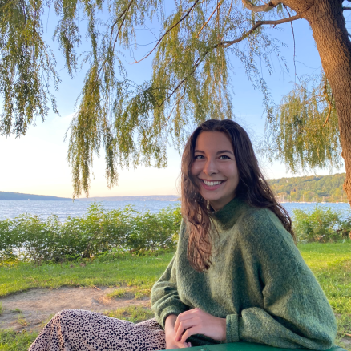

```{r img-with-knitr, echo=FALSE, fig.align='left', out.width='30%', out.extra='style="float:left; padding:10px"'}

```


I study [Information Science](https://infosci.cornell.edu/) at Cornell University, where I’m advised by [Matthew Wilkens](https://mattwilkens.com/) and [David Mimno](https://mimno.infosci.cornell.edu/). My research interests include cultural analytics, computational rhetoric, reception studies, and the digital humanities.

I just finished a project finding how Supreme Court Justices curate judicial personas through rhetorical strategies in court opinions–and whether this can be modeled computationally. I also do research at Authors AI, creating text analysis reports for authors with [Marlowe](https://authors.ai/marlowe/) and helping readers find community and discover books at [BingeBooks](https://bingebooks.com/). 

Prior to returning to my graduate studies, I was an Instructor at Washington State University in the [Department of English](https://english.wsu.edu/), the [Digital Technology and Culture](https://dtc.wsu.edu/) program, and the [Women’s, Gender, and Sexuality Studies](https://wgss.wsu.edu/) program. I received my Master’s degree in Literature at WSU with an MA thesis that investigated the strategic and rhetorical tactics of Supreme Court Justices. Before that, I completed my undergraduate degree at the University of Nebraska in English and Film Studies. At Nebraska, I got involved with the digital humanities through the Nebraska Literary Lab and the (then) nascent [George Eliot Archive](https://georgeeliotarchive.org/history).

I co-authored, with Matthew Jockers, the second edition of [Text Analysis With R](https://link-springer-com.proxy.library.cornell.edu/book/10.1007/978-3-030-39643-5).